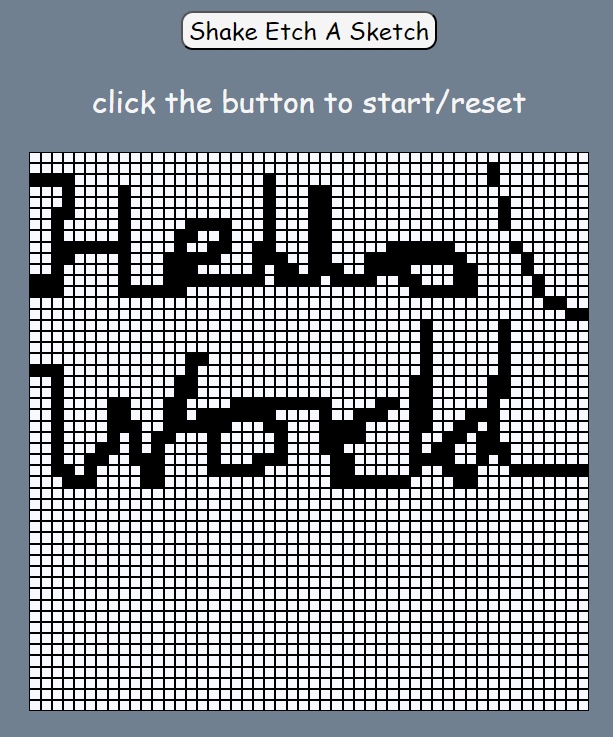

# Etch-A-Sketch

Etch-a-Sketch is a web-based drawing game where you can create drawings by moving your mouse over a grid of squares. 
This project was built using HTML, CSS, and JavaScript.
&nbsp;&nbsp;&nbsp;[Click here for live preview]()

## Features

- Click the "Shake Etch A Sketch" button to reset the grid.
- Move your mouse over the grid to draw with a black color.
- Create a new grid with custom dimensions by clicking the "Shake Etch A Sketch" button and entering a new size.
